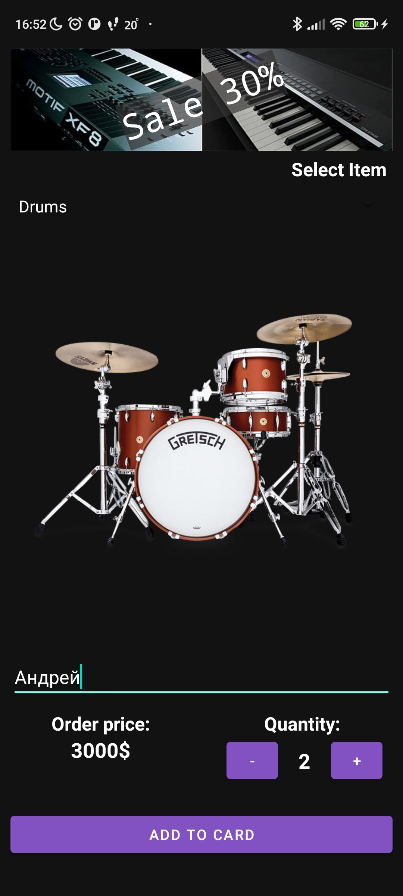

# MusicShop
Простое приложение магазина музыкальных инструментов в котором я использую сингл активити с двумя фрагментами.
Первый фрагмент основной UI приложения, где есть возможность выбрать товар из списка, указать имя покупателя, указать количество товара и сделать заказ.
Второй фрагмент с подробной информацией заказа и кнопкой отправки заказа по email
 
 
 
 
